# KeepMoments ML Service

## Обзор

FastAPI-сервис для автоматического подбора и ранжирования фотографий при заполнении фотоальбомов. Сервис объединяет несколько техник машинного обучения: мультимодальные эмбеддинги CLIP, кластеризацию для обеспечения разнообразия и метрики технического качества изображений.

**Версия:** 0.1.0
**Runtime:** Python 3.11, FastAPI 0.115.0, PyTorch 2.4.1 (CPU)
**Хранилище:** AWS S3

---

## Эндпоинты

| Метод | Путь | Описание |
|-------|------|----------|
| `GET` | `/health` | Проверка работоспособности |
| `POST` | `/process` | Основной пайплайн обработки |

### POST /process

**Входные данные (`ProcessRequest`):**

```json
{
  "photo_ids": ["s3-key-1", "s3-key-2", "..."],
  "user_description": "romantic wedding with warm tones",
  "min_photos": 10,
  "max_photos": 20,
  "template": {
    "id": "template_1",
    "pages": [
      {"id": "page_1", "slots": [{"id": "slot_1", "photo_id": null}]}
    ]
  }
}
```

**Выходные данные (`ProcessResponse`):**

```json
{
  "filled_template": {
    "id": "template_1",
    "pages": [
      {"id": "page_1", "slots": [{"id": "slot_1", "photo_id": "s3-key-7"}]}
    ]
  }
}
```

---

## Конфигурация

Переменные окружения (файл `.env`):

| Переменная | По умолчанию | Описание |
|------------|--------------|----------|
| `AWS_ACCESS_KEY_ID` | — | AWS ключ доступа |
| `AWS_SECRET_ACCESS_KEY` | — | AWS секретный ключ |
| `AWS_REGION` | `us-east-1` | Регион AWS |
| `S3_BUCKET_NAME` | — | Бакет с фотографиями |
| `CLIP_MODEL_NAME` | `ViT-B/32` | Вариант модели CLIP |
| `KMEANS_RANDOM_STATE` | `42` | Сид воспроизводимости |
| `LOG_LEVEL` | `INFO` | Уровень логирования |

---

## Архитектура пайплайна

```mermaid
flowchart TD
    A([📥 POST /process\nProcessRequest]) --> B

    subgraph async["⚡ async FastAPI handler"]
        B[ThreadPoolExecutor\nasync → sync bridge]
    end

    B --> C

    subgraph pipeline["🔄 Основной пайплайн"]
        C["☁️ Шаг 1: Загрузка из S3\n━━━━━━━━━━━━━━━━━━━\n• Параллельная загрузка через ThreadPoolExecutor\n• Вход: photo_ids + S3 credentials\n• Выход: dict[photo_id → bytes]\n• Ошибки: пропуск с логированием"]

        C --> V1{Доступных фото\n≥ min_photos?}
        V1 -->|Нет| ERR1([❌ HTTP 503\nНедостаточно фото])
        V1 -->|Да| D

        D["📐 Шаг 2: Подсчёт слотов шаблона\n━━━━━━━━━━━━━━━━━━━━━━━━━━━━━\n• Обход: Template → Pages → Slots\n• Проверка: n_slots > 0\n• Выход: n_slots"]

        D --> E["🧮 Шаг 3: Расчёт n_select\n━━━━━━━━━━━━━━━━━━━━━━━━━━\nn_select = max(min_photos,\n  min(n_slots, max_photos))\ncap by len(available_photos)"]

        E --> F["🧠 Шаг 4: CLIP-эмбеддинги\n(Vision Encoder)\n━━━━━━━━━━━━━━━━━━━━━━━━\n• Кэшированная модель ViT-B/32\n• bytes → PIL.Image → preprocess\n• Батчевый инференс (CPU)\n• L2-нормализация\n• Выход: dict[photo_id → вектор 512d]"]

        F --> G["🗂️ Шаг 5: KMeans кластеризация\n(Визуальное разнообразие)\n━━━━━━━━━━━━━━━━━━━━━━━━━━━━\n• n_clusters = min(n_embeds, n_select)\n• sklearn KMeans, seed=42\n• Выход: dict[cluster_id → [photo_ids]]"]

        G --> H["📊 Шаг 6: Оценка качества\n(Техническое качество)\n━━━━━━━━━━━━━━━━━━━━━━━━\n• Резкость: дисперсия Лапласиана\n• Экспозиция: 1 - |яркость - 0.5|×2\n• Итог: 0.6×резкость + 0.4×экспозиция\n• Нормализация min-max по батчу\n• Выход: dict[photo_id → score ∈ [0,1]]"]

        H --> I["🎯 Шаг 7: Round-Robin отбор\n(Разнообразие + Качество)\n━━━━━━━━━━━━━━━━━━━━━━━━\n• Сортировка внутри кластеров\n  по quality (убывание)\n• Round-robin по кластерам:\n  лучшее из кл.0, кл.1, кл.2...\n• Выход: list[n_select photo_ids]"]

        I --> J["🔤 Шаг 8: Переранжирование\nпо тексту (CLIP Text Encoder)\n━━━━━━━━━━━━━━━━━━━━━━━━━━━━━\n• Токенизация user_description\n• Текстовый вектор (L2-норм.)\n• Косинусное сходство:\n  text_vec · photo_embed\n• Сортировка по сходству (убывание)\n• Выход: list[photo_ids] по релевантности"]

        J --> K["📋 Шаг 9: Заполнение шаблона\n━━━━━━━━━━━━━━━━━━━━━━━━\n• Перебор ranked photos\n• Обход: Pages → Slots (по порядку)\n• Последовательное назначение\n  photo_id → slot\n• Незаполненные слоты → null\n• Выход: FilledTemplate"]
    end

    K --> L([📤 HTTP 200\nProcessResponse\nfilled_template])

    style A fill:#4A90D9,color:#fff,stroke:#2C5F8A
    style L fill:#27AE60,color:#fff,stroke:#1A7A40
    style ERR1 fill:#E74C3C,color:#fff,stroke:#A93226
    style async fill:#FFF9E6,stroke:#F0C040
    style pipeline fill:#F0F8FF,stroke:#4A90D9
    style V1 fill:#F39C12,color:#fff,stroke:#D68910
```



---

## Стратегия многомерного отбора

Пайплайн последовательно применяет четыре критерия отбора:

```
Разнообразие          Качество             Релевантность
     │                    │                     │
     ▼                    ▼                     ▼
KMeans               Quality Score         CLIP Text
Clustering           (Sharpness +          Re-ranking
(visual groups)      Exposure)             (user intent)
     │                    │                     │
     └──────────┬──────────┘                    │
                ▼                               │
         Round-Robin                            │
         Selection ──────────────────────────►  │
                                                ▼
                                     Final ranked photo list
```

| Шаг | Цель | Метод |
|-----|------|-------|
| Кластеризация | Покрытие визуального пространства | KMeans на CLIP-эмбеддингах |
| Quality Score | Технически хорошие снимки | Лапласиан + яркость |
| Round-Robin | Баланс разнообразия и качества | Циклический обход кластеров |
| Text Re-rank | Соответствие описанию пользователя | Косинусное сходство CLIP |

---

## Обработка ошибок

Сервис реализует **graceful degradation** — частичные сбои не блокируют весь запрос:

| Сценарий | Поведение |
|----------|-----------|
| Ошибка загрузки отдельного фото из S3 | Лог-предупреждение, фото пропускается |
| Ошибка препроцессинга изображения | Лог-предупреждение, фото пропускается |
| Ошибка расчёта качества | Оценка качества = 0.0 |
| Пустое `user_description` | Порядок из Round-Robin сохраняется |
| Ошибка text re-ranking | Исходный порядок сохраняется |
| Доступных фото < `min_photos` | HTTP 503 |
| Шаблон без слотов | HTTP 422 |

---

## Структура модулей

```
ml/
├── app/
│   ├── main.py              # FastAPI app, /process, /health
│   ├── config.py            # Settings (pydantic-settings, lru_cache)
│   ├── dependencies.py      # boto3 S3 client DI
│   ├── schemas.py           # ProcessRequest, ProcessResponse, Template models
│   └── pipeline/
│       ├── s3_loader.py     # Параллельная загрузка из S3
│       ├── embeddings.py    # CLIP image encoder + кэш модели
│       ├── clustering.py    # KMeans кластеризация
│       ├── quality.py       # Оценка резкости и экспозиции
│       ├── selector.py      # Round-robin отбор
│       ├── reranker.py      # CLIP text encoder + переранжирование
│       └── template_filler.py # Заполнение шаблона
├── Dockerfile
├── requirements.txt
└── .env.example
```

---

## Деплой

**Docker:**
```bash
cd ml
cp .env.example .env   # заполнить AWS credentials
docker build -t keepmoments-ml .
docker run --env-file .env -p 8000:8000 keepmoments-ml
```

**Локально (Python 3.11+):**
```bash
cd ml
pip install -r requirements.txt
uvicorn app.main:app --reload
```
